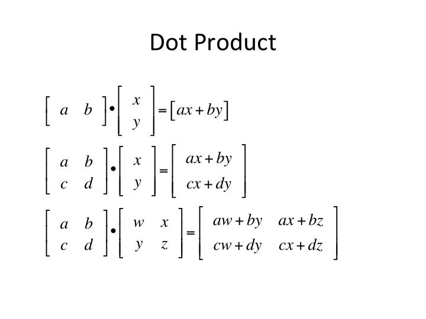

---

```{r setup, include=FALSE}
knitr::opts_chunk$set(echo = TRUE, warning = FALSE, error = FALSE, message = FALSE)
```

## Packages
```{r}
library(tensorflow)
library(reticulate)
#use_virtualenv("r-tensorflow")
#import("scipy")
#library(keras)
library(keras)
library(tidyverse)
library(reshape2)
library(ggplot2)
library(cowplot)
library(rcdk)
#install.packages("BiocManager")
#BiocManager::install("ChemmineR")
```

## One dimensional tensors
```{r}
## normal R vector
x <- c(1, 3, 6, 78, 1)
glimpse(x)

## convert to array
x_array <- as.array(x)
glimpse(x_array)
```

## Let's get some molecule SMILES and fingerprints
```{r}
fp <- read_csv(
  here::here(
    "data",
    "compound_morgan_fp_toxcast.csv"
  )
)
fp
```

## Visualize some molecules
```{r, eval=FALSE}
#library(ChemmineR)
smiles <- c('CCC', 'CCN', 'CCN(C)(C)',
            'c1ccccc1Cc1ccccc1',
            'C1CCC1CC(CN(C)(C))CC(=O)CC')

#sdf <- smiles2sdf("CC(=O)OC1=CC=CC=C1C(=O)O")

source(
  here::here(
    "R",
    "rdkit_wrappers.R" # thanks to Tom Luechtefeld (ToxTrack) for sharing this code
  )
)
```

```{r}
fp$canonical_smiles[20] %>%
  molFromSmiles2() %>% showmols()
```

## Take a look at the fingerprints
Here we inspect the fingerprints as they are and transform them into a 2D tensor that could be fed into a DL network.
```{r}
fp[3, c(1:10)] %>% head(2) %>% knitr::kable()
x <- fp[1,c(2:10)] %>% as.integer()
as.array(x) %>%
  glimpse()

fp_data <- fp[,c(2:1025)] %>% as.matrix()
fp_labels <- fp$canonical_smiles

fp_tensor <- array_reshape(fp_data, dim = c(20, 1024))
fp_tensor[c(1:5), c(30:35)] %>% head
fp_tensor %>% glimpse
```

## Visualize fingerprints
Here, I show only the first 32 Bits of 20 tensors, encoding the 20 molecules.
```{r, include=FALSE}
labels <- fp$canonical_smiles 

fp_int <- map_df(
  fp[,c(2:33)],
  as.integer
  )

fp_mtrx <- 
fp_int %>%
  as.matrix()

row.names(fp_mtrx) <- labels
colnames(fp_mtrx) <- c(1:32)

fp_mtrx %>% 
  pheatmap::pheatmap(
    cluster_rows = FALSE, 
    cluster_cols = FALSE,
    legend = FALSE, angle_col = 0) -> fig_fp

png(filename = "fp.png", width = 1000)
fig_fp
dev.off()
```

## MNIST handwritten digits
See for more information on MNIST and NIST datasets: 
```{r}
library(keras)
library(tensorflow)

mnist <- dataset_mnist()
train_images <- mnist$train$x
train_labels <- mnist$train$y
test_images <- mnist$test$x
test_labels <- mnist$test$y
```

## MNIST training samples
60,000 samples

```{r}
train_images %>% glimpse()
first_image_train <- train_images[1,,] %>% as.array %>% glimpse
train_labels %>% glimpse()
```

## Visualize the tensor of 2 train digits: `5` & `4` 
```{r, include=FALSE}
A <- train_images[1,,]
library(reshape2)
library(ggplot2)

longData<-melt(A)
#longData<-longData[longData$value!=0,]

five <- ggplot(longData, aes(x = Var2, y = Var1)) + 
  geom_raster(aes(fill=value)) + 
  scale_fill_gradient(low="grey90", high="red") +
  labs(x="pixels", y="pixels") +
  theme_bw() + theme(axis.text.x=element_text(size=9, angle=0, vjust=0.3),
                     axis.text.y=element_text(size=9),
                     plot.title=element_text(size=11)) + scale_y_reverse()

A <- train_images[3,,]

longData<-melt(A)
#longData<-longData[longData$value!=0,]
four <- ggplot(longData, aes(x = Var2, y = Var1)) + 
  geom_raster(aes(fill=value)) + 
  scale_fill_gradient(low="grey90", high="red") +
  labs(x="pixels", y="pixels") +
  theme_bw() + theme(axis.text.x=element_text(size=9, angle=0, vjust=0.3),
                     axis.text.y=element_text(size=9),
                     plot.title=element_text(size=11)) + scale_y_reverse()

ggsave(filename = "four.png", plot = four)
ggsave(filename = "five.png", plot = five)
```

```{r}
cowplot::plot_grid(five, four, labels = c("Five", "Four"), label_x = -0.02, label_size = 10) 
```

## Transform to tensor and normalize the data
```{r}
train_images <- array_reshape(train_images, c(60000, 28*28))
train_images <- train_images/255

test_images <- array_reshape(test_images, c(10000, 28*28))
test_images <- test_images/255

```

## MNIST deep learning model
See for the complete [tutorial and optimal model](https://tensorflow.rstudio.com/guide/keras/)
```{r}
mnist <- dataset_mnist()

## transform to tensors and normalize train and test data
train_images <- mnist$train$x
train_images[train_images > 0] %>% ## the matrix is sparse so we have very many zeros, this shows all non-zero values
  max() # confirm the max value is 255
nrow(train_images)

train_images <- array_reshape(train_images, c(60000, 28 * 28)) ## transform to 2D tensor
train_images <- train_images / 255 # this normalizes the grey-scale values to double values between 0-1 

test_images <- mnist$test$x
## in the test dataset there are 10,000 images
test_images <- array_reshape(test_images, c(10000, 28 * 28))
test_images <- test_images / 255

## get labels
train_labels <- mnist$train$y
test_labels <- mnist$test$y

## convert labels to categories
train_labels <- to_categorical(train_labels)
test_labels <- to_categorical(test_labels)

model <- keras_model_sequential() 
model %>% 
  layer_dense(units = 256, activation = 'relu', input_shape = c(784)) %>% 
  layer_dropout(rate = 0.4) %>% 
  layer_dense(units = 128, activation = 'relu') %>%
  layer_dropout(rate = 0.3) %>%
  layer_dense(units = 10, activation = 'softmax')


model %>% compile(
  optimizer = "rmsprop",
  loss = "categorical_crossentropy",
  metrics = c("accuracy")
)

model %>% 
  fit(
    x = train_images, y = train_labels,
    epochs = 5,
    validation_split = 0.3,
    verbose = 2
  )

```

## Model evaluation
To predict the first ten digits in the test set and see the predicted labels.
```{r}
metrics <- model %>% evaluate(test_images, test_labels)
metrics
model %>% predict(test_images[1:10,]) %>% k_argmax() -> predictions
predictions
mnist$test$y[1:10]

```

# Some notes on hyperparameters

## Rectified Linear Activation Function (ReLU)
ReLU is an activation function that will replace any value that =< 0 for 0 and return the input > 0 as input > 0. It functions as an activator and simplifies the input data to the hidden layers of the network. The ReLU function is used to increase learning speed and efficiency. 
```{r}
relu_simple <- function(input){
  
  any <- function(input){
  result <- if(input > 0){
  input
  } else {
    0
  }
  return(result)
  }
  res <- map_dbl(input, any)
  return(res)
}

relu_simple(0)
relu_simple(-1)
relu_simple(1)

relu_example <- c(1,0,1,2,3,0,1,-3,-4)
relued <- relu_simple(relu_example)
relued
```

## Dropout
A dropout layer will output randomly seeded zero's in an input vector. It is there to prevent overfitting of the network. It introduces zero's in the hidden layer, prior to passing the data onto the output layer. This is also called regularization.
```{r}
x <- c(1,3,4,5,1,0,1,9,1,0,1,1,1,1,4,5,6)

dropout_simple <- function(input, size = 0.05*length(input)){
  
  n <- length(input)*size
  toreplace <- sample(x = seq_along(input), size = n, replace = FALSE)
  input[toreplace] = 0
  return(input)
}

set.seed(123)
y <- dropout_simple(input = x, size = 0.2)
plot(x,x)
plot(x, y)

```

# Matrix dot product 
As example to matrix transformations



```{r}
knit
```


```{r}
x <- c(1:4)
x_mtrx <- matrix(x, nrow = 2)
y <- c(10,20,30,40)
y_mtrx <- matrix(y, nrow = 2)

## dot product vector * vector
x %*% y
## manual


```
